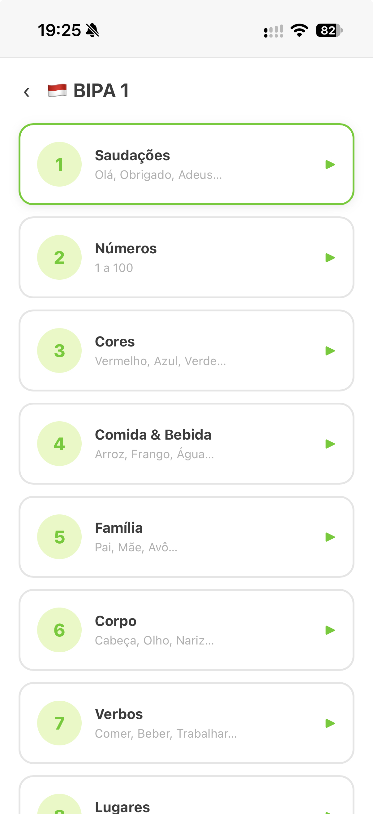
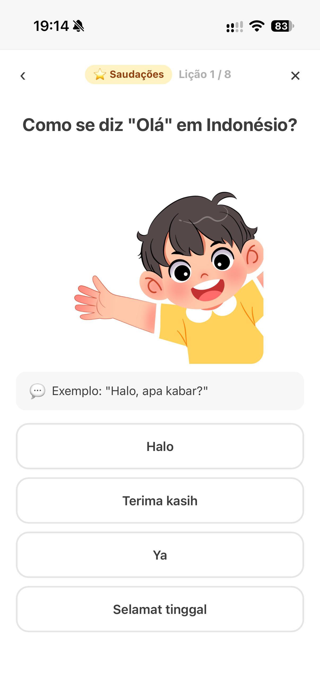
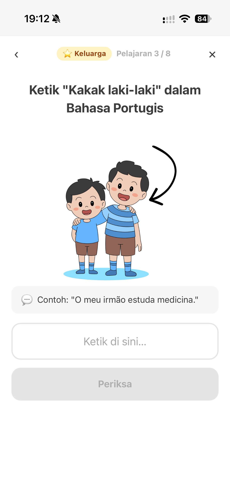
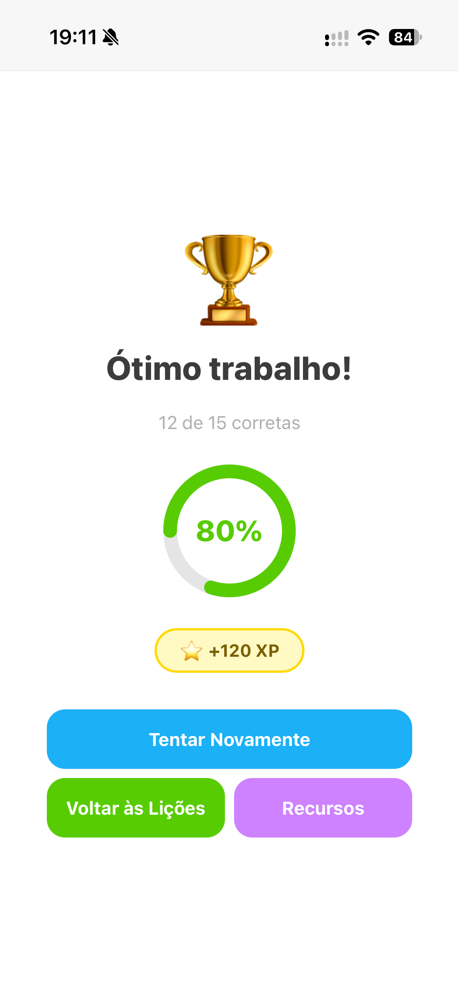

# BecaBecaBahasa

A lightweight, offline-capable Progressive Web App for learning **Portuguese (pt-PT)**, **Indonesian** and **French** through short, interactive exercises.

**Try it live: [becabecabahasa.com](https://becabecabahasa.com/)**

The interface is available in **Portuguese** and **Indonesian**, so Portuguese speakers can learn Indonesian (and French), Indonesian speakers can learn Portuguese (and French), and so on.

> *Beca* + *Bahasa*: "language" in Indonesian.

## Features

- **Three target languages**: European Portuguese, Indonesian and French
- **Levels mapped to CEFR (A1–C2)**, following each language's official exam framework:
  - Portuguese: ACESSO, CIPLE, DEPLE, DIPLE, DAPLE, DUPLE
  - Indonesian: BIPA 1–6
  - French: DELF A1–B2, DALF C1–C2
- **Many exercise types**:
  - Multiple choice (word → meaning, meaning → word)
  - Typing answers
  - Listening (text-to-speech)
  - Speaking (speech recognition with fuzzy matching)
  - Word matching, true/false reading comprehension
  - Gap fill and dialogue completion
  - Short tutorials and reading passages
- **Images** for vocabulary
- **Reference resources**: grammar and vocabulary tables for each language
- **Works offline**: a Service Worker caches the app after the first visit
- **Installable**: add it to your phone's home screen like a native app
- **No accounts, no tracking**: only your UI language preference is stored, in your browser

## Screenshots

<div align="center">
<table align="center">
  <tr>
    <td align="center"></td>
    <td align="center"></td>
  </tr>
  <tr>
    <td align="center"><sub>Indonesian lessons (BIPA 1), Portuguese interface</sub></td>
    <td align="center"><sub>Multiple choice</sub></td>
  </tr>
  <tr>
    <td align="center"></td>
    <td align="center"></td>
  </tr>
  <tr>
    <td align="center"><sub>Typing the answer</sub></td>
    <td align="center"><sub>Lesson results</sub></td>
  </tr>
</table>
</div>

## Tech stack

- Vanilla JavaScript, HTML and CSS: no frameworks, no bundler
- [Web Speech API](https://developer.mozilla.org/docs/Web/API/Web_Speech_API) for text-to-speech and speech recognition (no audio files)
- Service Worker with network-first (HTML) and stale-while-revalidate (CSS/JS) caching
- Hosted on [Cloudflare Pages](https://pages.cloudflare.com/), with images served from Cloudflare R2

## Project structure

```
.
├── build.js            # Deploy step: stamps the Service Worker cache version
├── images/             # Screenshots shown in this README
└── pwa/                # The app (served as-is)
    ├── index.html
    ├── manifest.json
    ├── sw.js           # Service Worker
    ├── _headers        # Cloudflare Pages cache headers
    ├── css/style.css
    ├── icons/icon.svg
    └── js/
        ├── data.js       # Languages, levels, lessons, images, resources
        ├── i18n.js       # UI translations (pt-PT / id-ID)
        ├── speech.js     # TTS and speech recognition helpers
        ├── exercises.js  # Exercise rendering and logic
        └── app.js        # State, navigation and screens
```

## Running locally

There is no build step for the app itself. Serve the `pwa/` folder with any static server:

```bash
# Option 1: Node
npx serve pwa

# Option 2: Python
python -m http.server 8000 --directory pwa
```

Then open the printed URL (for example `http://localhost:8000`).

> Speech recognition needs a supported browser (Chrome/Edge work best) and microphone permission. Service Workers only run on `localhost` or over HTTPS.

## Deploying (Cloudflare Pages)

| Setting | Value |
|---|---|
| Build command | `node build.js` |
| Build output directory | `pwa` |

`build.js` replaces `__BUILD_VERSION__` in `pwa/sw.js` with the commit SHA (`CF_PAGES_COMMIT_SHA`). Each deploy then gets a fresh cache, and users receive updates automatically.

## Adding content

Lessons live in `pwa/js/data.js` under `LESSONS[language][level]`. Exercises are created with small helper functions, for example:

```js
{
  id: 'pt-greetings',
  title: 'lessonGreetings',
  subtitle: 'lessonGreetingsSub',
  exercises: [
    mc('Olá', 'Olá', 'Halo', ['Olá', 'Adeus', 'Obrigado', 'Sim']), // multiple choice
    ta('Bom dia', 'Bom dia', 'Selamat pagi'),                     // type the answer
    sp('Obrigado', 'Obrigado', 'Terima kasih'),                    // speaking
  ],
}
```

Any new UI text must be added to **both** `pt-PT` and `id-ID` in `pwa/js/i18n.js`.

## Roadmap

- [x] Portuguese A1 (ACESSO)
- [x] Indonesian A1 (BIPA 1)
- [x] French A1 (DELF A1)
- [ ] More A1 topics (pronouns, adjectives, prepositions, time, phrases)
- [ ] A2+ content for all languages
- [ ] Progress tracking

## License

The source code is licensed under the [MIT License](LICENSE).

Images used in the app are not part of this repository and are not covered by this license. This includes the illustrations visible in the screenshots in `images/`.
